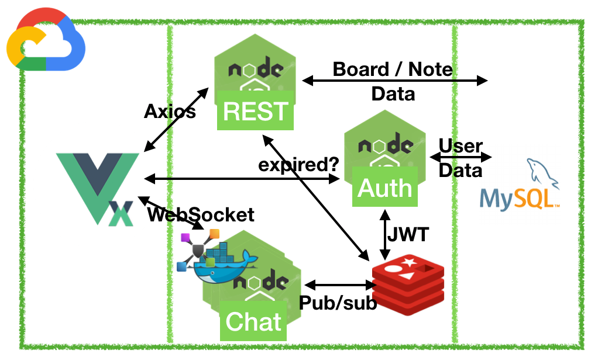
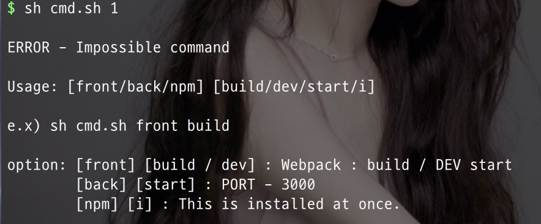
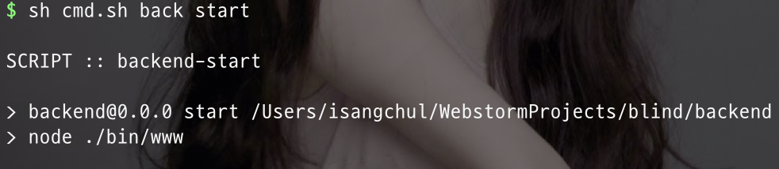
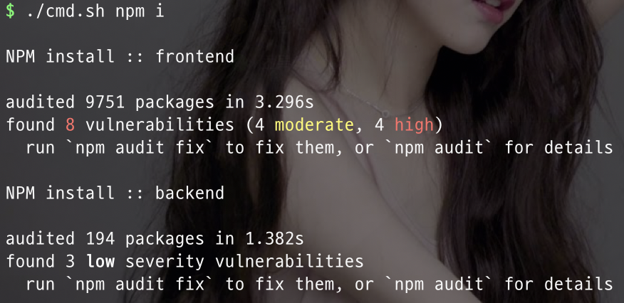

# Toy-Blind

<a href="https://1ilsang.blog.me/"></a>
<a href="#"></a>
<a href="#"></a>
<a href="#"></a>

### 0. 목표
   - 블라인드 앱을 모방해 보자.
   - 
	
### 1. 기술스택
   - Main: `Vue, Vuex, Node.js, MySQL, Redis: Pub/Sub, JWT`
   - Module: `Express, Helmet, Bcrypt, Multer, Axios, NodeMailer, Socket.io`
   - Infra: `Linux, Docker, GCP: VM, Storage, Cloud Function(Img Resizing)`

### 2. 기능
   - 회원 CRUD
       - 중요: 어떻게 익명성을 지킬 것인가?
   - 게시판 CRUD
       - 좋아요 on/off
       - 댓글 CRUD
       - 대댓글 CRUD
   - 1:N 채팅
   - 쪽지 보내기

### 3. 아키텍처
   -	
   - JWT 토큰을 통해 인증/인가 및 로드벨런싱된 채팅 서버간의 pub/sub 을 위한 Redis.

### 4. 개발과정
   1. [초반설계 및 Bash 쉘 스크립팅](https://blog.naver.com/1ilsang/221549601659)
   2. [Vue 프론트 따라 만들기](https://blog.naver.com/1ilsang/221552922387)
   3. [회원가입(메일인증) / 인증(JWT) / 로그아웃 - NodeMailer, JWT, Redis, Bcrypt, MySQL, Vuex](https://blog.naver.com/1ilsang/221556402323)
   4. [게시글 CRUD - 무한스크롤, 이미지 리사이징, GCP: Storage, Cloud function](https://blog.naver.com/1ilsang/221558340615)
   5. [Plugin 설정과 Vuex 모듈화, 단순 Socket 채팅방 구현](https://blog.naver.com/1ilsang/221560032593)
   6. [채팅 소켓 로드벨런싱 - HAProxy, Docker, Redis-pubsub, ShellScript](https://blog.naver.com/1ilsang/221563459499)
   7. [댓글 구현 및 문제점과 의문](https://blog.naver.com/1ilsang/221566493707)
   8. [대댓글 구현하기 - 디비 성능 개선기](https://blog.naver.com/1ilsang/221569040532)
   9. [ESLint 적용하기](https://blog.naver.com/1ilsang/221570867392)
   10. [Auth 서버 TypeScript 적용 및 모듈화 + TSLint](https://blog.naver.com/1ilsang/221573977959)
   11. [API-Gateway 구현과 Buffer 처리](https://blog.naver.com/1ilsang/221575505442)
   <br>
   개발중 ...

### 5. 어떻게 실행하나요?
   - Redis, MySQL 이 설치되어 있어야 합니다.
   - MySQL 테이블 정보는 덤프파일을 사용해 주세요.
   - 통합 커멘드 라인을 지원합니다
       ``` bash
       chmod +x cmd.sh
       sh cmd.sh [target] [option]
       ```
       
       
       
   - frontend / backend 디렉토리별 package.json 에 별도의 실행 스크립트가 있습니다.


License
---
This is released under the MIT license. See [LICENSE](LICENSE) for details.

