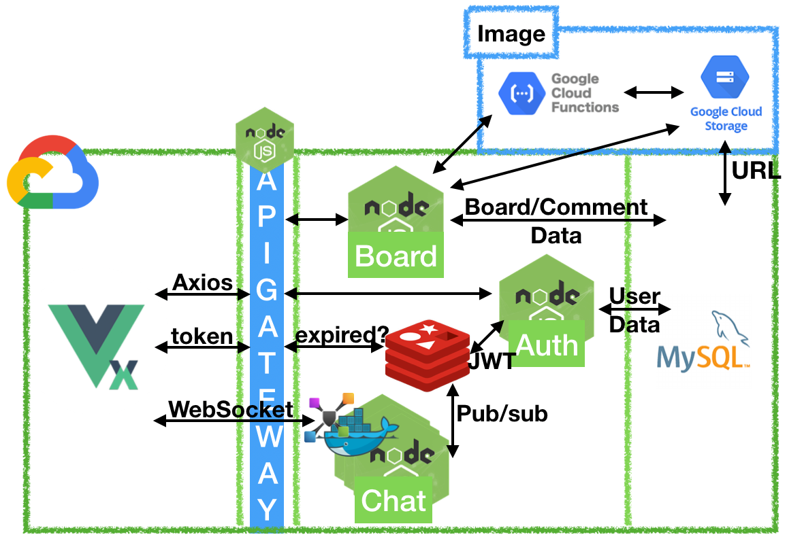

# Toy-Blind

### 0. 목표
   - 블라인드 앱을 모방해 보자.
	
### 1. 기술스택
   - Vue, Vuex, Node, Express, MySQL, Redis: Pub/Sub, JWT, WebSocket
   - Linux, Docker, GCP

### 2. 기능
   - 회원 CRUD
       - 중요: 어떻게 익명성을 지킬 것인가?
   - 게시판 CRUD
       - 좋아요 on/off
       - 댓글 CRUD
       - 대댓글 CRUD
   - 1:N 채팅
   - 쪽지 보내기

### 3. 아키텍처
   -	
   - JWT 토큰을 통해 인증/인가 및 로드벨런싱된 채팅 서버간의 pub/sub 을 위한 Redis.

### 4. 개발과정
   1. [초반설계 및 Bash 쉘 스크립팅](https://1ilsang.blog.me/221549601659)
   2. [Vue 프론트 따라 만들기](https://1ilsang.blog.me/221552922387)
   <br>
   개발중 ...

### 5. 어떻게 실행하나요?
   - 이후 수정할 계획. 아직 실행되지 않습니다.
   - //Redis, MySQL 이 설치되어 있어야 합니다.
   - //MySQL 테이블 정보는 덤프파일을 사용해 주세요.
   - //통합 커멘드 라인을 지원합니다
       ``` bash
       chmod +x cmd.sh
       sh cmd.sh [target] [option]
       ```
       
       
       
   - 또한 frontend / backend 디렉토리별 package.json 에 별도의 실행 스크립트가 있습니다.


License
---
This is released under the MIT license. See [LICENSE](LICENSE) for details.

